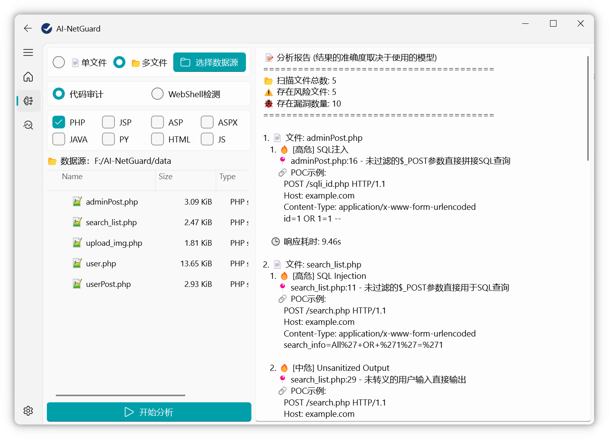
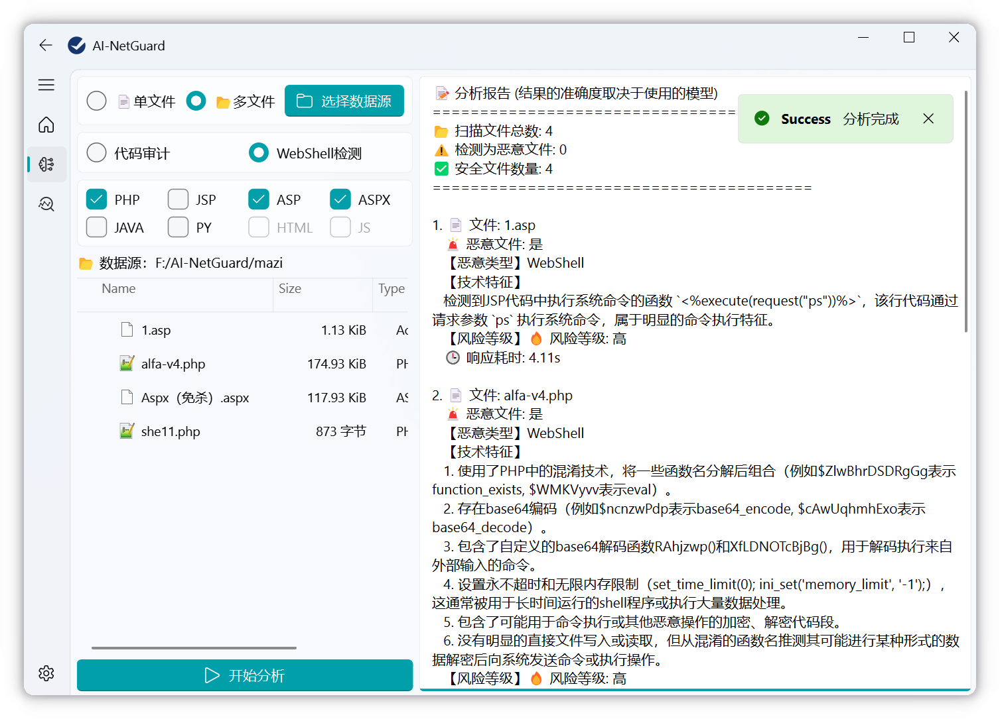
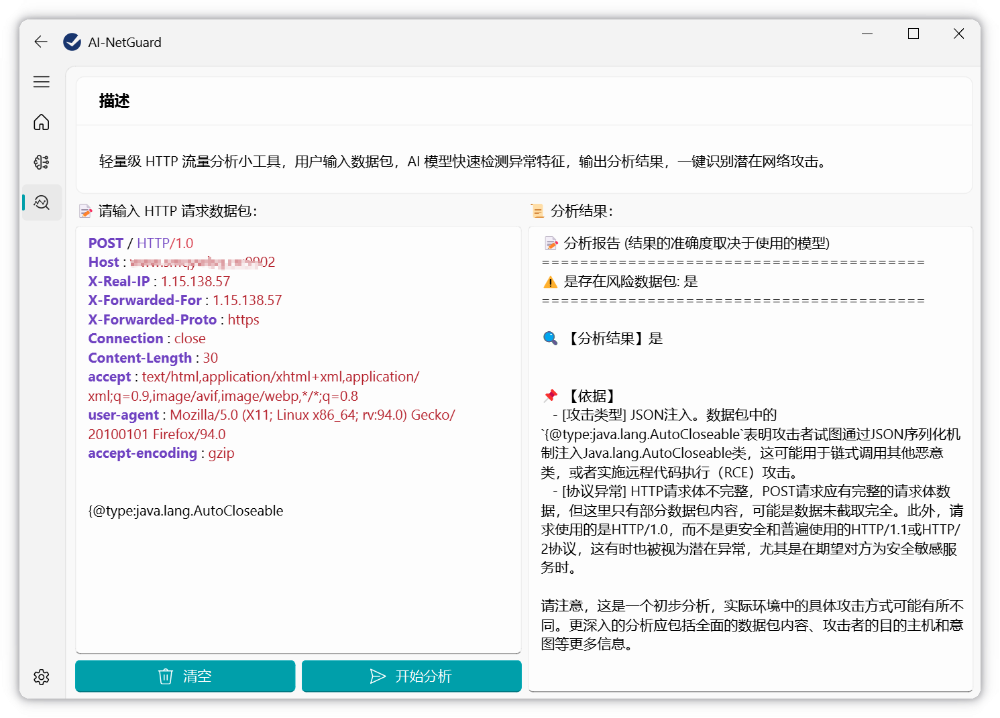
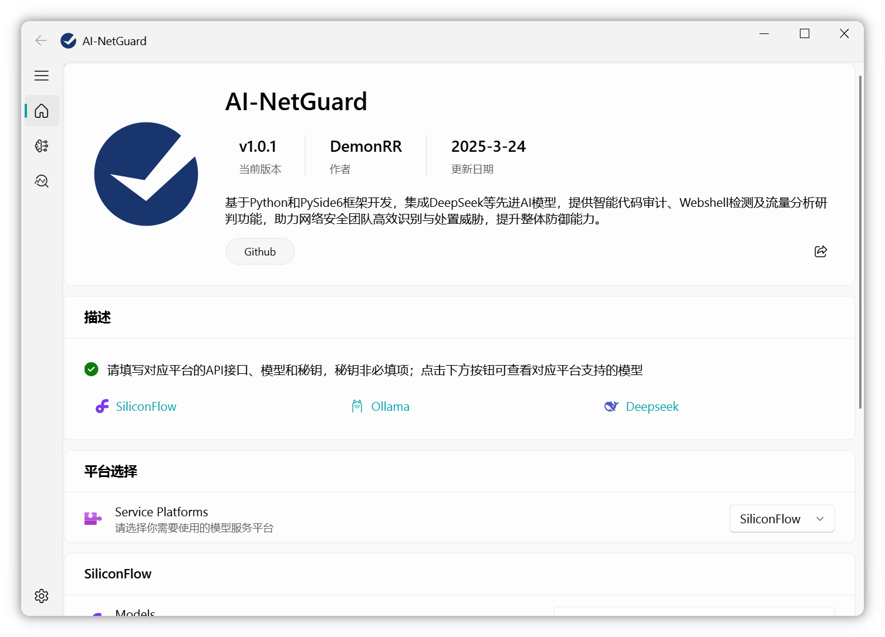
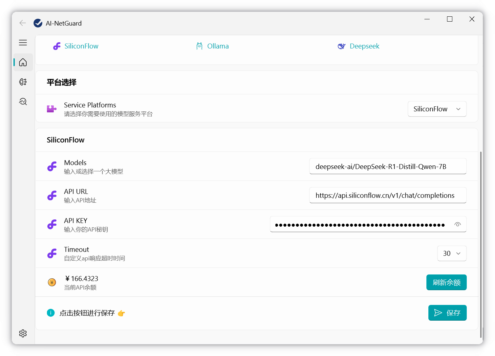
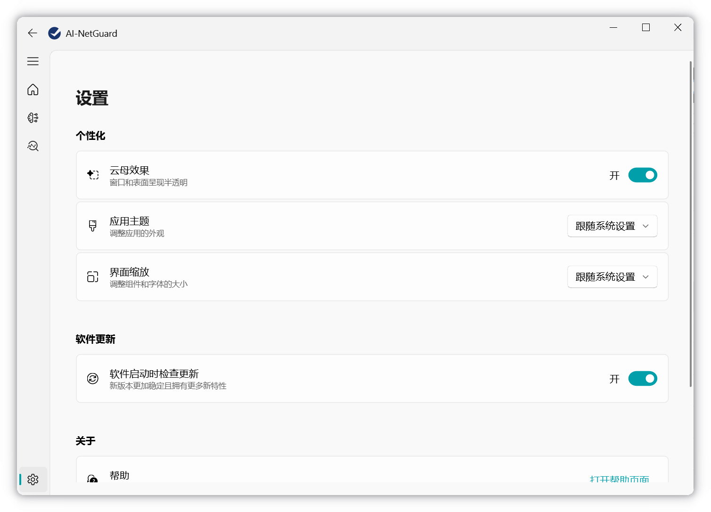

  <h1 align="center">AI-NetGuard</h1>

## 简介

基于Python和PySide6框架开发，集成DeepSeek等先进AI模型，提供智能代码审计、Webshell检测及流量分析研判功能，助力网络安全团队高效识别与处置威胁，提升整体防御能力。

目前支持接入平台：Ollama、Siliconflow、Deepseek

部分界面布局借鉴于大佬：ChinaRan0

## 功能

- [x] 代码审计
- [x] Webshell检测
- [x] 流量分析
- [x] 对接Deepseek
- [x] Api余额显示
- [x] 自定义响应超时时间
- [x] 支持多平台

## 展示

### 代码审计

### Webshell检测

### 流量分析

### 基础配置

### 设置

